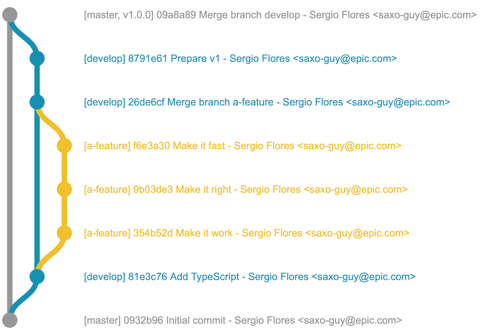

# @gitgraph/react

Draw pretty git graphs with React. A React-only fork of the archived [GitGraph.js](https://github.com/nicoespeon/gitgraph.js).


## Install

```sh
pnpm add @gitgraph/react
```

Requires `react >= 16.8`. Ships ESM + TypeScript types; use it through a bundler (Vite, Next.js, webpack…).

## Usage

```jsx
import { Gitgraph } from "@gitgraph/react";

function MyComponent() {
  return (
    <Gitgraph>
      {(gitgraph) => {
        const master = gitgraph.branch("master");
        master.commit("Initial commit");

        const develop = master.branch("develop");
        develop.commit("Add TypeScript");

        const aFeature = develop.branch("a-feature");
        aFeature
          .commit("Make it work")
          .commit("Make it right")
          .commit("Make it fast");

        develop.merge(aFeature);
        develop.commit("Prepare v1");

        master.merge(develop).tag("v1.0.0");
      }}
    </Gitgraph>
  );
}
```



`<Gitgraph>` also accepts `options` (`template`, `orientation`, `mode`, …) and, for imperative control, a `graph` prop created with `new GitgraphCore()`.

## Development

```sh
pnpm install
pnpm test        # vitest
pnpm typecheck   # tsc --noEmit
pnpm knip        # unused files/exports/deps
pnpm build       # tsc -> lib/
```

## License

MIT
